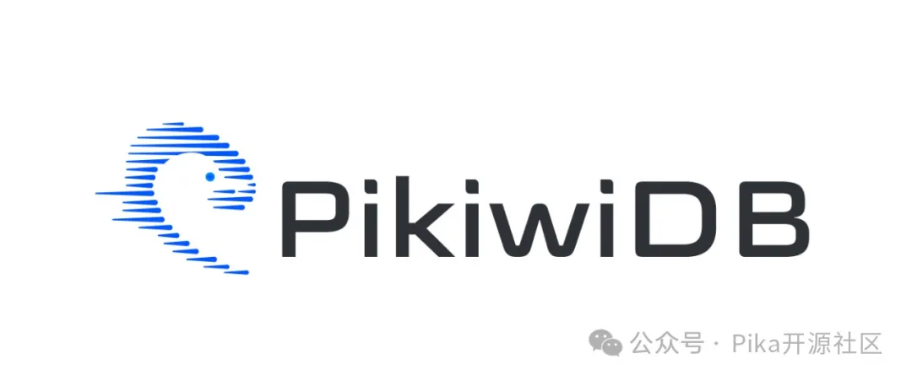

随着 Redis 宣布采用双协议以维护其商业利益之际，PikiwiDB(Pika) 社区非常荣幸地宣布，我们的最新 v3.5.3 正式生产可用版本现已发布。

v3.5.3 解决了历史遗留的 Bug，引入了多项新特性。这些特性主要包括 Pika 支持 ACL、删除 Sharing 模式残留的 Slot 代码、快慢命令分离、 Redis Stream、大 key 分析工具、Pika 分布式集群支持全自动化 failover 等功能，同时，我们在 3.5.3 版本丰富了更多的自动化测试 case，提升 Pika 服务的稳定性和健壮性，会让用户感受到更为高效和稳定的使用体验，本文主要阐述本次改动的相关重大 feature、bugfix 性能提升项。

在深入探讨 3.5.3 版本的更新内容之前，请注意以下几点声明：

1. 由于商标问题，Pika 项目已更名为 PikiwiDB。文中以 PikiwiDB(Pika) 指代项目     
   https://github.com/OpenAtomFoundation/pika
2. 我们新创建了一个项目     
   https://github.com/OpenAtomFoundation/pikiwidb
   这是一个基于 Raft 协议实现的兼容 Redis 协议的大容量 KV 数据库，主要面向强一致性数据场景，例如存储约 10TiB 规模的元数据。PikiwiDB  将专门用于指代此项目。
3. 我们为 PikiwiDB 设计了一个新的 logo，作为其商标，并已在相关政府机构注册。

1 重大改进

1.1 PikiwiDB(Pika) 支持 ACL

PikiwiDB(Pika) 3.5.3 版本正式全面支持 Redis ACL，为未来在云原生 Pika 集群中支持多租户场景奠定了基础。在此之前，Pika 已经支持了 Redis 的用户认证方式，如 auth/userpass/requirepass，以及通过 pika.conf 中的 userblacklist 配置命令黑名单模式。本次更新保持了向后兼容，并支持这些已有的使用方式。

我们还确保 PikiwiDB(Pika) 的 ACL 实现与 Redis ACL 完全兼容，通过将 Redis 的所有 ACL TCL 测试集纳入 PikiwiDB(Pika) 的测试集中。

关键 PR：
+ PikiwiDB(Pika)  支持 ACL
    https://github.com/OpenAtomFoundation/pika/pull/2013
+ 修正 ACL 用户认证错误问题
    https://github.com/OpenAtomFoundation/pika/pull/2449
+ ACL 向前兼容 userblacklist
    https://github.com/OpenAtomFoundation/pika/pull/2459
+ 添加 Redis ACL 测试集
    https://github.com/OpenAtomFoundation/pika/pull/2495

1.2 混合存储模型支持 bitmap 

在单体环境下，同时优化 PikiwiDB(Pika) 的读/写/compaction 是一项挑战。在 v3.5.2 版本中，我们引入了由缓存 Redis 和 RocksDB 构成的混合存储模型，并支持了 string/list/set/zset/hashtable 五种数据结构。在 3.5.3 版本中，我们增加了对 bitmap 的支持。

此外，我们在 3.5.3 版本中支持对 Redis 缓存进行动态参数调整。

关键 PR 链接：

+ 支持 bitmap 的支持：
    https://github.com/OpenAtomFoundation/pika/pull/2253

+ 另外，我们在 3.5.3 版本中支持对 Redis 缓存进行动态调参：
    https://github.com/OpenAtomFoundation/pika/pull/2197

1.3 快慢命令分离

+ 为了防止慢命令把快命令执行卡死，我们在 Codis-Proxy 和 PikiwiDB(Pika)  两个层面都实现了快慢命令分离。 
    https://github.com/OpenAtomFoundation/pika/pull/2162

1.4 Redis Stream

虽然 PikiwiDB(Pika) 之前支持了 Redis pubsub，但它只能进行在线消息传递。在 3.5.3 版本中，我们增加了对 Redis Stream 的有限支持，类似于消息队列（MQ），以便更安全地传递消息。为了确保数据的安全性，我们在底层引擎 BlackWidow 中特别添加了对 Stream 数据类型的支持。
关键 PR： 
+ Pika 支持 Redis Stream
    https://github.com/OpenAtomFoundation/pika/pull/1955
请注意，Pika Stream 目前还不支持消费组消费，这将在后续版本中实现。

1.5 云原生集群

在 PikiwiDB(Pika) 3.5.0 版本中，我们开源了 Pika-Operator，它支持在 K8s 上部署 Pika 主从对。在 3.5.2 版本中，我们基于 Kubeblocks 的 Pika-Operator 支持了在 K8s 上部署类似 Codis 的 Pika Cluster，但当时还不支持动态扩缩容。

在 3.5.3 版本中，最新的 Pika-Operator 已经支持了 Codis Group 级别的节点扩缩容，并且支持数据的 Rebalance。
关键 PR：

+ PikiwiDB(Pika)  Operator 支持 pika 集群自动扩容
    https://github.com/OpenAtomFoundation/pika/pull/2121

+ 优化 codis slot 迁移速度，支持动态修改迁移线程和速度
    https://github.com/OpenAtomFoundation/pika/pull/2486

+ Pika-operator 支持 namespace，在不同的 namespace 下部署不同的集群
     https://github.com/OpenAtomFoundation/pika/pull/2480

+ Pika-operator 支持监控指标采集，自动拉起 pika-expoter

    https://github.com/OpenAtomFoundation/pika/pull/2451
1.6 Compaction 改进

PikiwiDB(Pika) 的底层磁盘存储引擎 RocksDB 在进行 compaction 时会显著影响 PikiwiDB(Pika) 的读写性能。因此，控制好 compaction 是优化 Pika 读写性能的关键。
有关 compaction 的关键优化 PR 如下：

+ 添加 CompactRange 命令支持对一定范围内的 key 进行 compact
    https://github.com/OpenAtomFoundation/pika/pull/2163
+ 提升 Compaction 速度减少 Compaction 耗时 
    https://github.com/OpenAtomFoundation/pika/pull/2172
+ 执行 shutdown 命令时调用 disable compaction, 提升进程退出速度
    https://github.com/OpenAtomFoundation/pika/pull/2345

1.7 自动 Failover

PikiwiDB(Pika) 集群目前是基于 Codis 实现的。为了提高基于 Codis 的 PikiwiDB(Pika) Cluster 的易用性，我们对 Codis 进行了许多扩展。

原始的 Codis 不支持 Group 内的 Failover，需要使用 Redis Sentinel，这会导致运维成本增加。我们在 Codis Dashboard 中加入了 sentinel 的功能，实现了对 Group 内主从的自动 failover。

关键 PR：

+ PikiwiDB(Pika)  分布式集群支持自动 failover
    https://github.com/OpenAtomFoundation/pika/pull/2386

1.8 可观测性提升

PikiwiDB(Pika) 的可观测性关键组件是 Pika-Exporter。在 3.5.2 版本中，我们虽然添加了 Redis Cache 缓存热数据，但缺少监控指标。在 3.5.3 版本中，我们增加了包括命中率、每秒命中次数、Redis Cache 内存使用量、Redis Cache 个数、Redis Cache DB 个数 等指标。

关键 PR：

+ PikiwiDB(Pika)  exporter 暴露 cache 相关的数据采集指标   
    https://github.com/OpenAtomFoundation/pika/pull/2318
+ PikiwiDB(Pika)  分布式集群 Codis proxy 新增可观测指标   
    https://github.com/OpenAtomFoundation/pika/pull/2199
+ 修复dbsize 计算错误问题   
    https://github.com/OpenAtomFoundation/pika/pull/2494
+ 修复网络监控指标统计不准确的问题    
    https://github.com/OpenAtomFoundation/pika/pull/2234
1.9 数据一致性
3.5.3 版本修复了许多 PikiwiDB(Pika) 主从同步问题，确保数据的一致性。

关键 PR：

+ 修复主从复制过程中, slave 节点收到 master 异常回包后的处理逻辑    
    https://github.com/OpenAtomFoundation/pika/pull/2319
+ 修复 Pika cache 部分场景下 cache 和 DB 数据不一致的问题    
    https://github.com/OpenAtomFoundation/pika/pull/2225
+ 修复全量复制失败后，未做处理导致数据丢失问题    
    https://github.com/OpenAtomFoundation/pika/pull/2439
+ 修复主从复制过程中，主实例执行 bgsave 过程中，没有正确回应从的同步请求    
    https://github.com/OpenAtomFoundation/pika/pull/2437
+ 全量复制过程中，添加数据同步状态，明确数据同步进度   
    https://github.com/OpenAtomFoundation/pika/pull/2430
+ 修复从库在 Apply binlog 时，没有对操作的 key 加锁，导致数据不一致的问题   
    https://github.com/OpenAtomFoundation/pika/pull/2409
+ 修复迁移数据后数据不一致的问题   
    https://github.com/OpenAtomFoundation/pika/pull/2485

1.10 添加测试集

PikiwiDB(Pika)  测试集由 gtest 单测、Redis TCL 测试集和 Go 测试集组成：

+ gtest 单测主要测试 Pika  C++ 代码
+ Redis TCL 测试集来自 Redis，用于测试 PikiwiDB(Pika)  对 Redis 标准命令兼容度
+ Go 测试集可对 Pika 进行 Redis 命令测试、主从和 Codis 集群 e2e 测试 

3.5.3 中添加了 Codis 集群 e2e 测试，关键 PR 如下：

+ 丰富了 Pika TCL 测试集   
    https://github.com/OpenAtomFoundation/pika/pull/2497
+ 丰富了 Pika Gotest 测试集   
    https://github.com/OpenAtomFoundation/pika/pull/2502

1.11 工具集 
PikiwiDB(Pika) 一直重视工具集的建设，所有相关工具都可以在     https://github.com/OpenAtomFoundation/pika/tree/unstable/tools 中找到。在 3.5.3 版本中，我们新增了一个工具：

PikiwiDB(Pika)  支持大 key 分析工具
    https://github.com/OpenAtomFoundation/pika/pull/2195

1.12 文档更新

PikiwiDB(Pika) 的文档主要是 wiki 文档。在 3.5.3 版本中，我们更新了 Pika 支持的 Redis 命令文档。

文档链接：    https://github.com/OpenAtomFoundation/pika/wiki/pika-%E6%94%AF%E6%8C%81%E7%9A%84redis%E6%8E%A5%E5%8F%A3%E5%8F%8A%E5%85%BC%E5%AE%B9%E6%83%85%E5%86%B5
2 改进列表

在第一章节中，我们概述了 3.5.3 版本的主要功能升级和改进。下面详细列出了本次发版的相关 PR。

2.1 新特性

+ Pika 支持 ACL    

    https://github.com/OpenAtomFoundation/pika/pull/2013

+ 在全量复制的过程中，pika 服务的从节点不接收读请求    

    https://github.com/OpenAtomFoundation/pika/pull/2197
+ 删除 Sharing 模式残留的 Slot 代码，回归 3.0，以后一个 Pika 下有多个 DB，每个 DB 只有一个 Blackwidow    
    https://github.com/OpenAtomFoundation/pika/pull/2251
+ 在 Codis dashboard 协程 panic 时自动恢复服务    
    https://github.com/OpenAtomFoundation/pika/pull/2349
+ Pika cache 新增 bimap数据类型    
    https://github.com/OpenAtomFoundation/pika/pull/2253
+ Pika 支持快慢命令分离    
    https://github.com/OpenAtomFoundation/pika/pull/2162
+ Pika exporter 暴露 cache 相关的数据采集指标    
    https://github.com/OpenAtomFoundation/pika/pull/2318
+ Pika 执行完成 Bgsave 后, 保留 unix timepoint   
    https://github.com/OpenAtomFoundation/pika/pull/2167
+ Pika 支持动态配置 disable_auto_compations 参数   
    https://github.com/OpenAtomFoundation/pika/pull/2257
+ Pika 支持 Redis Stream   
    https://github.com/OpenAtomFoundation/pika/pull/1955
+ Pika 支持大 key 分析工具   
    https://github.com/OpenAtomFoundation/pika/pull/2195
+ Pika 支持动态调整 Pika cache 参数   
    https://github.com/OpenAtomFoundation/pika/pull/2197
+ 更新 Pika benchmark 工具支持更多的接口压测   
    https://github.com/OpenAtomFoundation/pika/pull/2222
+ Pika Operator 支持 pika 集群自动扩容   
    https://github.com/OpenAtomFoundation/pika/pull/2121
+ 添加 CompactRange 命令支持对一定范围内的 key 进行 compact   
    https://github.com/OpenAtomFoundation/pika/pull/2163
+ 提升 Compaction 速度减少 Compaction 耗时    
    https://github.com/OpenAtomFoundation/pika/pull/2172
+ 升级 RocksDB 版本到 v8.7.3    
    https://github.com/OpenAtomFoundation/pika/pull/2157
+ Pika 分布式集群 Codis proxy 新增可观测指标    
    https://github.com/OpenAtomFoundation/pika/pull/2199
+ Pika 分布式集群支持自动 failover    
    https://github.com/OpenAtomFoundation/pika/pull/2386
+ Pika 支持 redis rename-command 功能    
    https://github.com/OpenAtomFoundation/pika/pull/2455
+ 优化 codis slot 迁移速度，支持动态修改迁移线程和速度   
    https://github.com/OpenAtomFoundation/pika/pull/2486
+ Pika 支持动态调整 max-conn-rbuf-size 参数   
    https://github.com/OpenAtomFoundation/pika/pull/2434
+ Pika-operator 支持 namespace，可以在不同的 namespace 下部署不同的集群   
    https://github.com/OpenAtomFoundation/pika/pull/2480
+ Pika-operator 支持监控指标采集，自动拉起 pika-expoter   
    https://github.com/OpenAtomFoundation/pika/pull/2451
+ ACL 向前兼容 userblacklist   
    https://github.com/OpenAtomFoundation/pika/pull/2459
+ 丰富了 Pika TCL 测试集   
    https://github.com/OpenAtomFoundation/pika/pull/2497
+ 丰富了 Pika Gotest 测试集   
    https://github.com/OpenAtomFoundation/pika/pull/2502

2.2 bug 修复

+ 修复 Pika 有从节点进行全量复制期间会误删除 dump 文件的问题   
    https://github.com/OpenAtomFoundation/pika/pull/2377
+ 修复主从复制过程中, slave 节点收到 master 异常回包后的处理逻辑   
    https://github.com/OpenAtomFoundation/pika/pull/2319
+ 在 Pika 执行 shutdown 命令时调用 disable compaction, 提升进程退出速度   
    https://github.com/OpenAtomFoundation/pika/pull/2345
+ 修复 Codis-dashboard Redis Memory 值不准确的问题    
    https://github.com/OpenAtomFoundation/pika/pull/2337
+ INFO 命令耗时优化，降低查磁盘使用量的频率    
    https://github.com/OpenAtomFoundation/pika/pull/2197
+ 修复 Rsync 删除临时文件路径不对，删除失败，导致rocksdb打开失败的问题    
    https://github.com/OpenAtomFoundation/pika/pull/2186
+ 修复 Compact ,Bgsave ,Info keyspace 命令未指定db名称，导致部分命令 coredump 的问题    
    https://github.com/OpenAtomFoundation/pika/pull/2194
+ Codis dashboard 用 info replication 替代 info 命令查寻 master ip 降低对 Pika 的性能影响    
    https://github.com/OpenAtomFoundation/pika/pull/2198
+ 修复 Pika cache 使用边缘case，解决部分场景下 cache 和 DB 数据不一致的问题    
    https://github.com/OpenAtomFoundation/pika/pull/2225
+ 修复当 dump 文件夹为空时，会启动报错 Segmentation fault 的问题    
    https://github.com/OpenAtomFoundation/pika/pull/2265
+ 修复因为 flag 计算错误，导致的部分命令缓存没有生效问题    
    https://github.com/OpenAtomFoundation/pika/pull/2217
+ 修复主从复制模式下，主实例 flushdb 后，从实例因为死锁导致的不能访问的问题   
    https://github.com/OpenAtomFoundation/pika/pull/2249
+ 修复部分命令未对 RocksDB 的返回值进行判断的问题    
    https://github.com/OpenAtomFoundation/pika/pull/2187
+ 规范函数的返回值及初始值    
    https://github.com/OpenAtomFoundation/pika/pull/2176
+ 修复网络监控指标统计不准确的问题    
    https://github.com/OpenAtomFoundation/pika/pull/2234
+ 修复配置文件加载部分参数异常的问题    
    https://github.com/OpenAtomFoundation/pika/pull/2218
+ 修复 Codis dashboard cpu 100% 的问题    
    https://github.com/OpenAtomFoundation/pika/pull/2393
+ 修复 Codis fe pika 主从角色显示异常的问题    
    https://github.com/OpenAtomFoundation/pika/pull/2387
+ 修复迁移数据后数据不一致的问题    
    https://github.com/OpenAtomFoundation/pika/pull/2485 
+ 修复dbsize 计算错误问题    
    https://github.com/OpenAtomFoundation/pika/pull/2494
+ 修复扩缩容或者 pod 起停后，Codis-dashboard 界面显示不准确的问题    
    https://github.com/OpenAtomFoundation/pika/pull/2475
+ 修复 DB 层重复上锁的问题    
    https://github.com/OpenAtomFoundation/pika/pull/2372 
+ 修复全量复制失败后，未做处理导致数据丢失问题     
    https://github.com/OpenAtomFoundation/pika/pull/2439
+ 修复主从复制过程中，主实例执行 bgsave 过程中，没有正确回应从的同步请求    
    https://github.com/OpenAtomFoundation/pika/pull/2437
+ 全量复制过程中，添加数据同步状态，明确数据同步进度    
    https://github.com/OpenAtomFoundation/pika/pull/2430
+ 修复从库在 Apply binlog 时，没有对操作的 key 加锁，导致数据不一致的问题    
    https://github.com/OpenAtomFoundation/pika/pull/2409
+ 修复 codis slot 迁移过程中 master 实例 coredump 的问题   
    https://github.com/OpenAtomFoundation/pika/pull/2415
+ 修复在主从复制过程中，删除正在使用的 dump 文件的问题    
    https://github.com/OpenAtomFoundation/pika/pull/2377
+ 修复主从复制过程中从实例 rsync 响应错误的问题   
    https://github.com/OpenAtomFoundation/pika/pull/2319

2.3 发版 tag
    https://github.com/OpenAtomFoundation/pika/releases/tag/v3.5.3
3 社区

如果你有任何疑问，欢迎加入交流群，PikiwiDB(Pika) 开源社区感谢大家的支持和帮助。