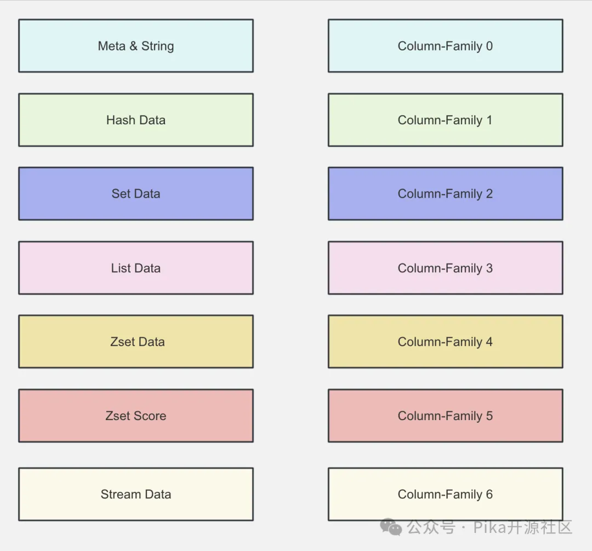

尊敬的社区成员及技术爱好者们：
PikiwiDB 社区荣耀地宣告——经过 9 个月打磨并在生产环境稳定运行 5 个月的 PikiwiDB(Pika) v4.0.0 【下文简称 Pika】今天正式发布。希望基于第三代存储引擎 Floyd 的这个新版本能为社区用户们带来更卓越的体验。

## 1 重大改进
1.1 第三代存储引擎 Floyd
Floyd 如同其前代 Blackwidow，基于 RocksDB，不仅支持基础的 String 结构，也原生支持了 Hash、List、Set、Stream及 ZSet 等 KKV 形式的复合数据结构。

+ RocksDB 实例数可配置

摒弃了 Blackwidow 按数据类型采用 RocksDB 实例的物理隔离模式，Floyd 采用了 RocksDB 的 Column-Family 虚拟隔离机制，在单个 RocksDB 实例下可存储所有类型的数据。用户可自由设定 Pika 实例中每个 DB【等同于Redis DB】中 RocksDB 实例的数量，而数据的存储则依据 key 的 hash 值分配至相应的 RocksDB 实例，减小了数据的空间放大和读放大效应，实现了机器资源的高效利用。

+ 禁止重复 key

基于 RocksDB 的 Column-Family 虚拟隔离机制，Floyd 把所有类型的 key 和 string 一起存储在 Column-Family 0。在此存储基础之上，可明确禁止不同类型的 key 重复，这一设计旨在杜绝潜在的数据冗余与不一致性，与 Redis 服务特性保持一致，进一步提升了系统的整体效率与数据质量。

+ Floyd 详细说明

如果对 Floyd 存储引擎感兴趣，请详阅《Floyd 存储引擎》【链接：https://github.com/OpenAtomFoundation/pika/discussions/2052】。由于 Floyd 前后进行了多个版本的迭代，所以阅读该 github discussion 文档时请注意前后时间，如有相关冲突性说法，以最新日期的文字为准。

关键 PR：
+ PikiwiDB(Pika)  支持 Floyd 存储引擎   
https://github.com/OpenAtomFoundation/pika/pull/2413
+ 添加 Floyd 的 compaction-filter 的 Gtest   
https://github.com/OpenAtomFoundation/pika/pull/2669
+ Pika 不支持不同类型的重复 key, 写入重复 key 返回非法类型   
https://github.com/OpenAtomFoundation/pika/pull/2609
+ 对 HyperLogLog 和 String 进行类型隔离，确保 HyperLogLog 操作与 String 操作明确区分开   
https://github.com/OpenAtomFoundation/pika/pull/2720
+ 添加支持分区索引过滤的功能   
https://github.com/OpenAtomFoundation/pika/pull/2601

1.2 Mget 批量查询缓存

Pika v3.5.2 的热数据缓存只实现了对热点 Key 的点查(如get/hget)，在后续的 v3.5.3 和 v3.5.4 修复若干 bug 后，对热数据的点查目前已经非常稳定。然而并未支持批量查询(如 mget etc)。
内部业务侧反馈批量查询速度比较慢，在 40C/256GiB/2TiB SATA SSD 规格机器上数据量超过 100GiB 时，Pika v3.3.6 30% 批量查询延迟超过 35ms。但由于 Pika 热数据缓存尚未支持批量查询，性能并未改善。

为了满足业务需求，Pika 团队开发了批量查询热数据缓存功能，显著提升了批量查询性能，降低了查询延迟和失败率。相关技术细节请阅读《PikiwiDB (Pika) 混合存储之批量查询》 【链接：https://mp.weixin.qq.com/s/KFLPruSdB66TMRxUfR9PbQ 】。

关键 PR ：

+ Mget 支持多 key 查询缓存, 记录未命中的 key 去 DB 中查询，提升 Pika 服务的读性能   
https://github.com/OpenAtomFoundation/pika/pull/2675
+ 修复 Mget 没有使用解析 ttl 的函数导致出现部分key的ttl未被更新，数据不一致的问题   
https://github.com/OpenAtomFoundation/pika/pull/2730

1.3 主从复制

Pika v3.3.6 有很多主从复制的缺陷。v4.0.0 版本对 Pika 全量复制及增量复制进行了大量优化和 bug 修复，取得了非常好的效果。 
并在 info 命令中输出了 "repl_connect_status" 指标(PR 2638)，以方便用户更加明确清晰的确定当前的主从复制状态。

关键 PR ：

+ 修复批量扩容时，多个 slave 同时连接 master, 短时间多次 bgsave 导致部分从节点数据不完整的问题   
https://github.com/OpenAtomFoundation/pika/pull/2746
+ 修复 Spop 在写 binlog 时可能会出现竞态问题   
https://github.com/OpenAtomFoundation/pika/pull/2647
+ 修复多 DB 下全量同步超时后不重试的问题   
https://github.com/OpenAtomFoundation/pika/pull/2667
+ 修复多 DB 主从超时场景下，可能会出现窗口崩溃的问题   
https://github.com/OpenAtomFoundation/pika/pull/2666
+ 修复主从同步限速逻辑中重复解锁的问题   
https://github.com/OpenAtomFoundation/pika/pull/2657
+ 重构主从复制模式 slave 节点的主从同步线程模型，尽可能减少 binlog 消费阻塞问题   
https://github.com/OpenAtomFoundation/pika/pull/2638

1.4 Redis Stream

Redis Stream 类似于消息队列（MQ），以便更安全地传递消息。为了确保数据的安全性，底层引擎 BlackWidow 和 Floyd 中特别添加了对 Stream 数据类型的支持。
关键 PR： 
+ 修复 pkpatternmatchdel 命令使用错误导致的 stream 类型数据删除异常的问题   
https://github.com/OpenAtomFoundation/pika/pull/2726
+ 修复 Keyspace 命令未计算 Stream 类型数据的问题   
https://github.com/OpenAtomFoundation/pika/pull/2705

1.5 Compaction

PikiwiDB(Pika) 的底层磁盘存储引擎 RocksDB 在进行 compaction 时会显著影响 PikiwiDB(Pika) 的读写性能。因此，控制好 compaction 是优化 Pika 读写性能的关键。

Floyd 使用了 v8.7.3 版本的 RocksDB，开放了更多 RocksDB 参数，以方便用户优化 RocksDB 性能：

+ enable-partitioned-index-filters： 支持加载分区索引过滤器，加快 RocksDB 查找速度。
+ min-write-buffer-number-to-merge: 默认值为 1，如果将此值设置得更大，意味着需要更多的写缓冲区被填满后才进行 flush。这样可以减少 flush 的频率，增加数据在内存中的累积量，从而可能提高写入吞吐量。
+ level0-stop-writes-trigger: 默认值为 36，定义了 L0 层中 sst 文件的最大数量，一旦达到这个数量，RocksDB 将会采取 暂停写入、强制 compaction 等措施来防止写入操作继续累积，以避免 L0 层变得过于庞大，进而可能导致写入放大、查询性能下降等问题。
+ level0-slowdown-writes-trigger：默认值为 20，用于控制当 Level 0 的 SST 文件数量达到这个阈值时，触发写减速（write slowdown），防止 Level 0 的文件数量过多，导致后续 compaction 操作的压力过大。
+ level0-file-num-compaction-trigger：默认值为 4，当 Level 0 的 SST 文件数量达到这个参数设定的阈值时，RocksDB 会开始执行 compaction 操作，将 Level 0 的文件合并到 Level 1，以减少 Level 0 的文件数量，降低读取延迟，并优化存储空间的利用率。
+ max-subcompactions：默认值为 1，用于控制RocksDB 中并发执行的 sub-compaction 任务数量，其值为 1 表示关闭 sub-compaction。如果系统资源充足，建议提升该参数以优化 compaction 效率。
+ max-bytes-for-level-base：指定了 L1 SST 文件总的大小。这个大小是 RocksDB 进行数据分层管理和 compaction 决策的重要依据：如果 L1 层的大小设置得太小，可能会导致 L0 层的 compaction 过于频繁，进而影响写性能。反之，如果设置得太大，可能会占用较多的磁盘空间，并且影响读取性能，因为读取操作可能需要跨越更多的层级。Pika 没有在 pika.conf 中开放此参数给用户配置，而是使用其他参数（level0-file-num-compaction-trigger 和 write-buffer-size）计算后的结果。

storage_options_.options.max_bytes_for_level_base = g_pika_conf->level0_file_num_compaction_trigger() * g_pika_conf->write_buffer_size()

关键 PR：
添加 Floyd 的 compaction-filter 的 Gtest
https://github.com/OpenAtomFoundation/pika/pull/2669
添加支持分区索引过滤的功能
https://github.com/OpenAtomFoundation/pika/pull/2601
新增 RocksDB Compaction 策略动态调整参数，用户可以根据业务调整 Compaction 策略，降低 Compaction 操作对服务性能的损耗
https://github.com/OpenAtomFoundation/pika/pull/2538
1.6 可观测性
v3.5 版本增加了包括命中率、每秒命中次数、Redis Cache 内存使用量、Redis Cache 个数、Redis Cache DB 个数 等指标，但是在集群方面的可观测性是缺失的。v4.0.0 对 Codis-Proxy 的 P99、P999、延迟等监控指标进行采集和展示，可以直观地反映线上 Codis-proxy 的运行情况。

v4.0.0 开始还提供新的工具：根据 pika benchmark 工具压测结果自动生成可视化的统计图表。

关键 PR：
Codis 支持 info 命令, 可以通过该命令查询 Codis-proxy 的 info 信息
https://github.com/OpenAtomFoundation/pika/pull/2688
Codis-proxy 新增 P99 P95 等监控耗时指标
https://github.com/OpenAtomFoundation/pika/pull/2668
添加 Pika 压测指标，提升 Pika 压测效率，并输出可视化的统计图表
https://github.com/OpenAtomFoundation/pika/pull/2663

1.7 测试集
PikiwiDB(Pika)  测试集由 gtest 单测、Redis TCL 测试集和 Go 测试集组成。v4.0.0 中丰富了诸多特性的 go test 功能，并进一步完善了基本数据类型的 TCL 测试。
关键 PR：
添加 Floyd 的 compaction-filter 的 Gtest
https://github.com/OpenAtomFoundation/pika/pull/2669
Pika Geo 数据类型增加 TCL 测试，并修复测试过程中遇到的缺陷
https://github.com/OpenAtomFoundation/pika/pull/2753
1.8 跨平台
PikiwiDB(Pika)  以往仅支持 centos 和 ubuntu 等 linux 平台，v3.5 开始支持 Mac 等平台。v4.0.0 将对 Mac 平台的支持扩展至 FreeBSD 平台。
关键 PR：
Pika 支持在 FreeBSD14 平台上进行编译
https://github.com/OpenAtomFoundation/pika/pull/2711
2 改进列表
下面详细列出了本次发版的主要功能升级和改进。
2.1 新特性

+ Pika Geo 数据类型增加 TCL 测试，并修复测试过程中遇到的缺陷
    https://github.com/OpenAtomFoundation/pika/pull/2753
+ Pika 支持在 FreeBSD14 平台上进行编译打包
    https://github.com/OpenAtomFoundation/pika/pull/2711
+ Pika 线程整理，避免启动过多无用线程，对不同的线程进行命名，方便问题定位
    https://github.com/OpenAtomFoundation/pika/pull/2697
+ Mget 支持多 key 查询缓存, 记录未命中的 key 去 DB 中查询，提升 Pika 服务的读性能
    https://github.com/OpenAtomFoundation/pika/pull/2675
+ Codis 支持 info 命令, 可以通过该命令查询 Codis-proxy 的 info 信息
    https://github.com/OpenAtomFoundation/pika/pull/2688
+ 添加 Floyd 的 compaction-filter 的 Gtest
    https://github.com/OpenAtomFoundation/pika/pull/2669
+ Codis-proxy 新增 P99 P95 等监控耗时指标
    https://github.com/OpenAtomFoundation/pika/pull/2668
+ 添加 Pika 压测指标，提升 Pika 压测效率，并输出可视化的统计图表
    https://github.com/OpenAtomFoundation/pika/pull/2663
+ Pika 主从复制新增监控指标 repl_connect_status, 可以更加明确清晰的确定当前的主从复制的状态
    https://github.com/OpenAtomFoundation/pika/pull/2638
+ Pika 不支持不同类型的重复 key, 写入重复 key 返回非法类型
    https://github.com/OpenAtomFoundation/pika/pull/2609
+ 添加支持分区索引过滤的功能
    https://github.com/OpenAtomFoundation/pika/pull/2601
+ Pika 支持第三代存储引擎 Floyd, 通过支持多 rocksdb 实例、对 Blob 的使用进行优化、对过期数据的清理进行优化，提升了 Pika 实例的读写性能
    https://github.com/OpenAtomFoundation/pika/pull/2413

2.2 bug 修复

+ 修复 iter 未被析构，导致 pkpatternmatchdel 在返回之前不会删除 iter，这可能会导致 rocksdb 永远引用一个版本，导致数据不符合预期的问题
    https://github.com/OpenAtomFoundation/pika/pull/2785
+ 修复 config 参数 min-blob-size 带单位时解析错误的问题
    https://github.com/OpenAtomFoundation/pika/pull/2767
+ 修复 zverank 返回值异常的问题
    https://github.com/OpenAtomFoundation/pika/pull/2673
+ 修复 Pika-port 传输数据过程中报错的问题
    https://github.com/OpenAtomFoundation/pika/pull/2758
+ 修复因为堆上分配的缓冲区越界导致 Dbsize 命令运行时崩溃的问题
    https://github.com/OpenAtomFoundation/pika/pull/2749
+ 修复批量扩容时，多个 slave 同时连接 master, 短时间多次 bgsave 导致部分从节点数据不完整的问题
    https://github.com/OpenAtomFoundation/pika/pull/2746
+ 修复参数未初始化导致 slotsscan 等命令不能和 bgsave 命令相互制衡的问题
    https://github.com/OpenAtomFoundation/pika/pull/2745
+ 修复 Slotmigrate 迁移数据的过程中，返回值设置错误，异常场景下会终止数据迁移的问题
    https://github.com/OpenAtomFoundation/pika/pull/2741
+ 修复 Mget 没有使用解析 ttl 的函数导致出现部分key的ttl未被更新，数据不一致的问题
    https://github.com/OpenAtomFoundation/pika/pull/2730
+ 修复 pkpatternmatchdel 命令使用错误导致的 stream 类型数据删除异常的问题
    https://github.com/OpenAtomFoundation/pika/pull/2726
+ 修复 pkpatternmatchdel 不能正确删除掉对应的 keys 的问题
    https://github.com/OpenAtomFoundation/pika/pull/2717
+ 修复 ACL 密码验证错误问题
    https://github.com/OpenAtomFoundation/pika/pull/2714
+ 修复 Keyspace 命令未计算 Stream 类型数据的问题
    https://github.com/OpenAtomFoundation/pika/pull/2705
+ 对部分命令定制化处理逻辑，避免写 binlog 导致从节点的 binlog 解析失败的问题
    https://github.com/OpenAtomFoundation/pika/pull/2793
+ 修复 Pika cmdID 赋值在 Cmd 初始函数中，可能会导致并发构造的时候出现内存泄漏的问题
    https://github.com/OpenAtomFoundation/pika/pull/2692
+ 修复 ExpectedStale 未考虑 String 类型, 如果存在已经过期的 String 类型的 key, ExpectedStale 会返回错误的问题
    https://github.com/OpenAtomFoundation/pika/pull/2682
+ 修复 Spop 在写 binlog 时可能会出现竞态问题
    https://github.com/OpenAtomFoundation/pika/pull/2674
+ db instance 设置不合理时，给用户错误提示
    https://github.com/OpenAtomFoundation/pika/pull/2672
+ 修复 server_stat 中的数据竞态问题
    https://github.com/OpenAtomFoundation/pika/pull/2671
+ 修复多 DB 下全量同步超时后不重试的问题
    https://github.com/OpenAtomFoundation/pika/pull/2667
+ 修复多 DB 下全量同步超时后不重试的问题
    https://github.com/OpenAtomFoundation/pika/pull/2666
+ 修复主从同步限速逻辑中重复解锁的问题
    https://github.com/OpenAtomFoundation/pika/pull/2657
+ 发版支持自动打包 centos7 和 centos8 平台的二进制编译包
    https://github.com/OpenAtomFoundation/pika/pull/2535
+ 修复 Codis 侧的 getrange 命令没有返回预期结果的问题
    https://github.com/OpenAtomFoundation/pika/pull/2510

2.3 提升改进项

+ 更新 Pika Docker Readme, 可以按照 Readme 在 Docker 中部署 Pika 服务
    https://github.com/OpenAtomFoundation/pika/pull/2743
+ 优化重复查询 meta value 导致影响 Pika 服务读写性能的问题
    https://github.com/OpenAtomFoundation/pika/pull/2735
+ 支持对更多的 RocksDB 参数进行动态调整，用户根据不同的业务使用场景调整参数提升 Pika 的读写性能
    https://github.com/OpenAtomFoundation/pika/pull/2728
+ 对 HyperLogLog 和 String 进行类型隔离，确保 HyperLogLog 操作与 String 操作明确区分开
    https://github.com/OpenAtomFoundation/pika/pull/2720
+  更新了 PR 标题验证，不允许在标题末尾出现中文字符
    https://github.com/OpenAtomFoundation/pika/pull/2718
+ 重构主从复制模式 slave 节点的主从同步线程模型，尽可能减少 binlog 消费阻塞问题
    https://github.com/OpenAtomFoundation/pika/pull/2638
+ 新增 RocksDB Compaction 策略动态调整参数，用户可以根据业务调整 Compaction 策略，降低 Compaction 操作对服务性能的损耗
    https://github.com/OpenAtomFoundation/pika/pull/2538

2.4 发版 tag

       https://github.com/OpenAtomFoundation/pika/releases/tag/v4.0.0
3 社区
感谢所有为 v4.0.0 做出贡献的社区成员，包括 issue/PR 提交者、代码 reviewer 【排名不分先后，依据字母序列】：

    AlexStocks

    baerwang

    chejinge

    cheniujh

    chienguo

    guangkun123

    gukj-spel

    longfar-ncy

    lqxhub

    luky116

    Mixficsol

    saz97
    
    wangshao1

PikiwiDB (Pika) 开源社区热烈欢迎您的参与和支持。如果您有任何问题、意见或建议，请扫码添加 PikiwiDB 小助手【微信号: PikiwiDB】为好友，它会拉您加入官方微信群。