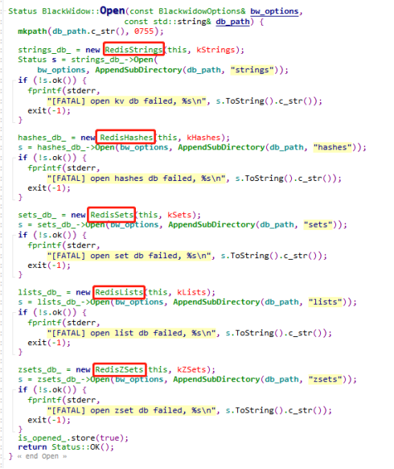
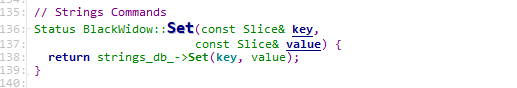
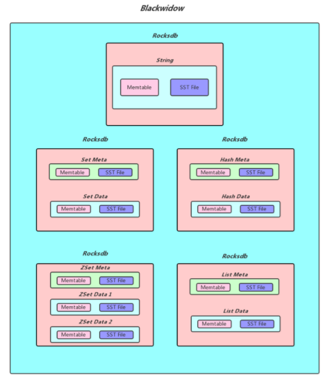

在《Pika源码学习--pika的命令执行框架》中我们了解了一个命令的执行流程，也知道了pika使用的是Blackwidow引擎，现在我们来看看pika是怎么和rocksdb对接的，Blackwidow具体怎么处理命令。

1.Pika和rocksdb对接
在Partition构造的时候，创建了一个BlackWidow，当前BlackWidow支持5种redis的数据结构，分别是String结构， Hash结构，List结构，Set结构和ZSet结构。一个BlackWidow分别为这5种数据结构打开了一个rocksdb，分别是 strings_db_，hashes_db_，sets_db_，zsets_db_，lists_db_，在BlackWidow::Open的时候打开了这个5个rocksdb：

在上面命令下来的时候，BlackWidow就会根据命令使用具体类型的db来操作

2.Redis命令与rocksdb kv的转换
因为rocksdb只支持kv的操作，那么redis的几种数据结构是怎么转换成rocksdb的kv的呢？官方有资料详细介绍了这个，我们根据官方资料学习即可（pika blackwidow引擎数据存储格式）https://github.com/Qihoo360/pika/wiki/pika-blackwidow引擎数据存储格式
这里引用官方的一个图，pika的每个分区是打开了5个rocksdb，一些数据结构的对接需要分开保存元数据和数据，元数据和数据分开存储是用了rocksdb的Column Family

