前一篇《Pika源码学习--pika的通信和线程模型》里说到WorkerThread里面有两种处理命令的方式，一种是同步，一种是异步。那什么时候是同步处理，什么时候是异步处理呢？其实
ClientConnFactory返回的PikaClientConn默认都是异步的。

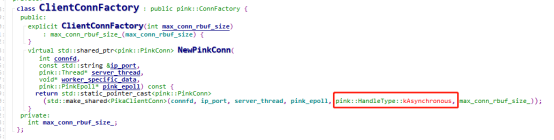

同步是在订阅推送里面用到，我们来了解一下pika的PubSub机制，这里以Subscribe/UnSubscribe命令为例。

1、PubSub线程

PikaServer里面单独起了一个线程用来处理订阅推送的消息

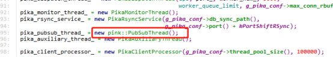

PubSubThread构造函数里面创建了两个管道，和前面介绍的一样，这里的管道是用来线程间通信用的，其中msg_pfd_是有推送消息到来时通知进行推送，notify_pfd_是用于连接的加入。

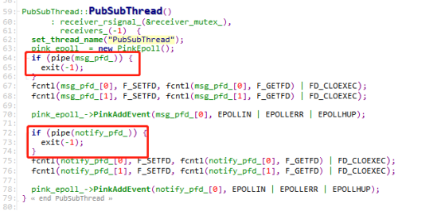

PubSubThread继承Thread，主逻辑入口是PubSubThread::ThreadMain，在ThreadMain里面主要处理新连接加入，推送，以及连接的消息，这几部分需要分别结合下面的介绍来说明。

2、Subscribe

Subscribe命令的入口是SubscribeCmd::Do，这里除了执行Subscribe主逻辑外，还做了下图框起来的两个关键的动作

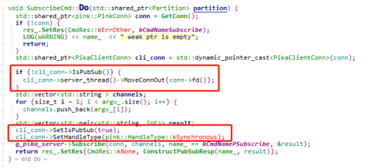

把连接的fd从WorkerThread线程的epoll中删除WorkerThread::MoveConnOut，设置PubSub标记并且把连接的HandleType改为同步模式。我们再看下Subscribe里面做了啥。订阅本身的逻辑比较简单，就是构造了一个channel和conn数组的Map pubsub_channel_，然后把channel和conn往这个map上加。

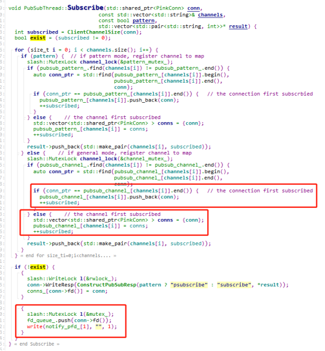

我们看下最下面的红框，前面把连接的fd从WorkerThread里面删除，这里把这个fd放到fd_queue，然后写了一个管道消息通知PubSub线程处理，我们看下PubSubThread::ThreadMain，如果是notify_pfd_来的消息，会把fd加到PubSubThread自己的epoll，所以如果有subscribe命令过来的时候，会把这个连接的fd从WorkerThread转移到PubSubThread这个单独的线程来处理。

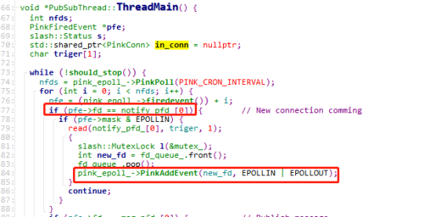

3、UnSubscribe
UnSubscribe命令的入口是SubscribeCmd::Do，理解了Subscribe的逻辑后，UnSubscribe的逻辑就比较好理解了，因为他做了和Subscribe相反的操作：PubSubThread::UnSubscribe里面会RemoveConn，把连接fd从PubSubThread的epoll删除；然后把连接加回WorkerThread的epoll，PubSub标记置为false

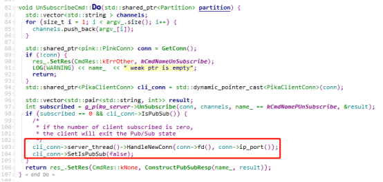

4、Publish
Publish命令的入口是PublishCmd::Do，主要逻辑是发管道消息通知PubSubThread主线程来处理推送

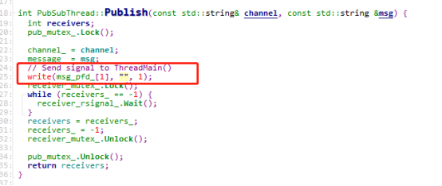

PubSubThread::ThreadMain如果收到推送的通知，则根据订阅关系进行推送

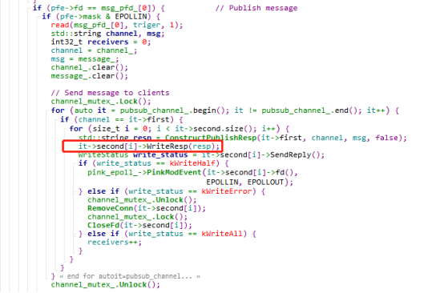

5、已订阅连接命令的处理
为啥需要把订阅的fd移到单独的PubSubThread线程，并且用同步处理呢？把订阅连接fd移到PubSubThread线程后，处理已有连接的消息的逻辑其实和在WorkerThread类似，也是用RedisConn::GetRequest来处理请求，只不过处理类型变成了同步。

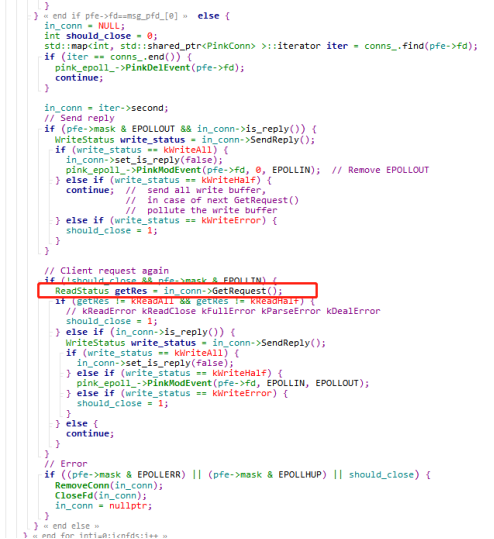

从前一篇文章我们可以知道，同步的处理是在ParserDealMessageCb函数

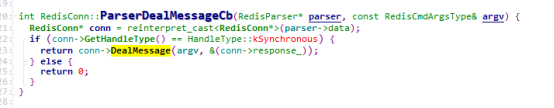

理论上讲这个PikaClientConn::DealMessage应该是要实现的才对，但是我下的最新的代码发现这个函数被改没了（commitid: c9f2a66b1741a9148402b42128f46c36d3d83444）

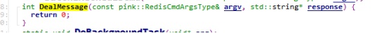

在commit记录里面找到了之前的实现，暂时没有研究这个为啥这样改，先按以前的代码看，不影响对整个逻辑的理解。可以看到DealMessage实际上也是调用了PikaClientConn::DoCmd。

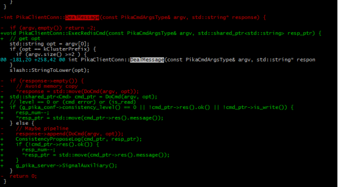

因为redis的PubSub实现是这样的，如果一个客户端正在订阅，那么这个客户端只能执行Subscribe/UnSubscribe/PSubscribe/UnSubscribe/Ping这几个命令，订阅和取消订阅是有时序关系的，而ping命令是可以直接处理的，所以这里应该是为了避免订阅和取消订阅发生时序错误，所以把订阅的连接移到单独的线程PubSubThread来处理，并且使用同步的处理方式。

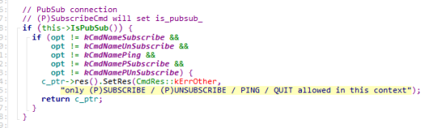