pika的线程模型有[官方的wiki介绍](https://github.com/OpenAtomFoundation/pika/wiki/pika-%E7%BA%BF%E7%A8%8B%E6%A8%A1%E5%9E%8B)，这里主要介绍了pika都有哪些线程，这些线程用来干嘛。本篇文章主要涉及监听线程DispatchThread、IO工作线程WorkerThread和工作线程池ThreadPool，结合代码介绍里面实现的一些细节。

    1.监听线程DispatchThread

在创建PikaServer的时候，会构造一个PikaDispatchThread，这个PikaDispatchThread，实际上是用了pink网络库的DispatchThread::DispatchThread

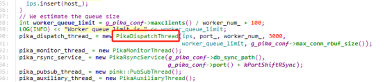

DispatchThread构造函数里面会初始化好若干个WorkerThread

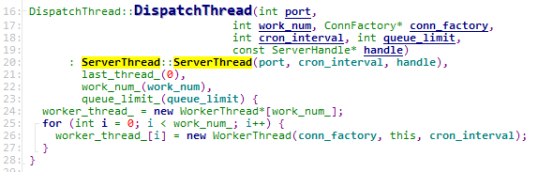

 DispatchThread继承自ServerThread，ServerThread继承了Thread，线程启动时实际上运行的是子类的ThreadMain方法，继承了Thread类的子类需要有自己的ThreadMain，监听线程start的时候，入口是ServerThread::ThreadMain()。线程启动会先ServerThread::InitHandle()，绑定和监听端口，下面看看ServerThread::ThreadMain()里面做了啥。

ServerThread::ThreadMain()主要逻辑是一个epoll，当有新的连接事件来的时候，accept，然后调用DispatchThread::HandleNewConn来处理这个新的连接

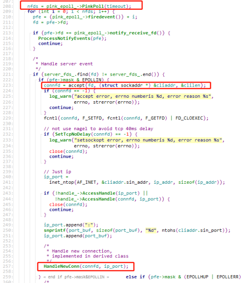

DispatchThread::HandleNewConn如何处理连接呢？实际上监听线程会把连接分发给IO工作线程WorkerThread来处理。每个WorkerThread都有一个PinkEpoll，PinkEpoll有一个notify_queue_，新的连接会以PinkItem的形式push到这个队列里面，然后通知WorkerThread来处理。分发的方式类似轮训，会按顺序分发给notify_queue_没有满的WorkerThread。

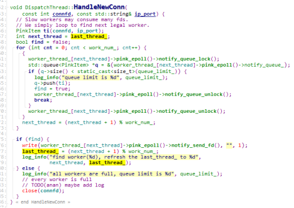

那么监听线程如何通知WorkerThread来处理新的连接呢？使用的是管道的方式，PinkEpoll会创建一个管道用来通知，并且把这个管道加到Epoll里面。在确定好要分发的WorkerThread后，往这个WorkerThread的管道写进去一个1字节的内容，来触发这个管道的读事件。

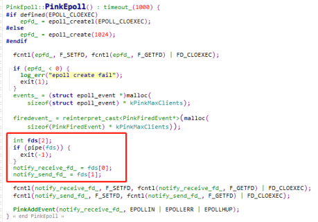

    2.IO工作线程WorkerThread

DispatchThread::StartThread的时候会起WorkerThread线程，WorkerThread也是继承了Thread，因此工作线程的入口是WorkerThread::ThreadMain。上文说到监听线程把新的连接放到WorkerThread的队列里面后，通知了WorkerThread进行处理。下面我们看看WorkerThread怎么处理的。
WorkerThread同样是一个Epoll，这里会处理新连接请求事件和已连接请求的事件，如果Epoll返回的fd是notify_receive_fd，即管道的接收fd，说明是内部的通知事件，一次性读取多个字节的内容，因为前面已知每个通知是1个字节，因此这里读到了多少个字节就说明有多少个通知，然后在一个循环里面处理这些请求。类型为kNotiConnect则是新的连接，这里会把监听线程push的PinkItem取出来，然后创建一个NewPinkConn，加到conns_里面，并且把这个fd加到WorkerThread的epoll，后续的消息事件就可以在这个epoll被处理。这里conn_factory用的是ClientConnFactory，返回的是PikaClientConn，继承了pink::RedisConn。

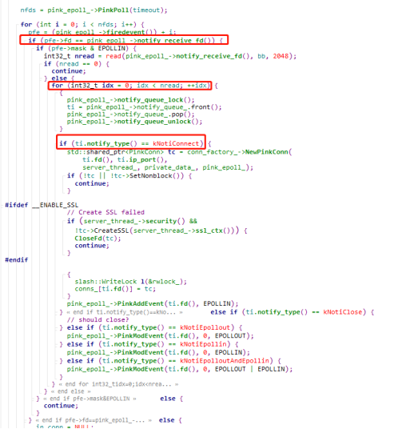

连接绑定到WorkerThread后，已建立连接的客户端发送请求过来，则是走的下面的分支，根据fd在conns_里面找到PinkConn，我们先只看读请求部分，回响应部分后面再看。

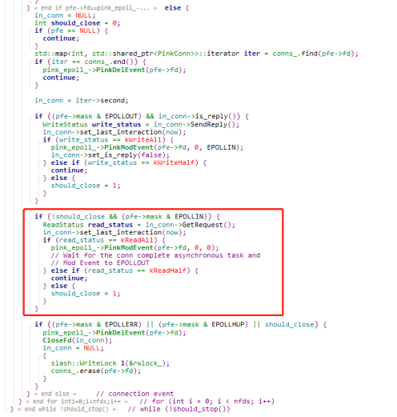

在conns_里面找到的是对应fd的PikaClientConn，使用RedisConn::GetRequest来读取客户端的的请求，此处有一个细节，如果read_status为kReadAll，则一次完整的请求被读取，会先把这个请求fd的读写事件给删除。这是为啥呢？删除了不是后续就处理不了这个请求的读写吗，这个我们后面讲到了再说明。
RedisConn::GetRequest里面，使用RedisParser::ProcessRequestBuffer来解析读取到的内容，然后有2种处理方式，DealMessage和Complete

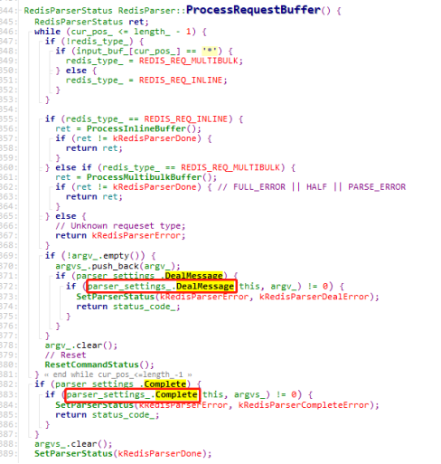

先看下这两个函数的初始化，DealMessage对应着ParserDealMessageCb，Complete对应着ParserCompleteCb

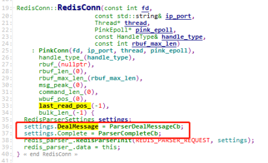

我们看这两个方法，原来一个是同步处理，一个是异步，同步的话就是一个个命令调用DealMessage来处理，异步的话是解析完合成一组命令统一调Complete处理。异步的处理方式是将请求的命令提交给线程池来处理PikaClientConn::AsynProcessRedisCmds，怎么提交的我们在工作线程池里面介绍。

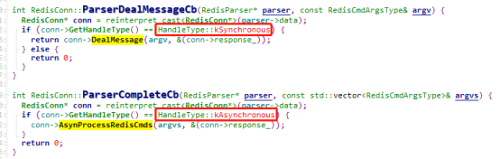

3.工作线程池ThreadPool

PikaServer构造的时候会创建一个PikaClientProcessor，PikaClientProcessor里面有一个ThreadPool，ThreadPool启动时会创建Worker线程，Worker线程实际的处理函数是ThreadPool::runInThread()

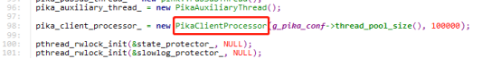

前面讲到WorkerThread解析完redis命令后会把命令提交给ThreadPool来处理，实际上是调用了线程池的ThreadPool::Schedule方法，Schedule需要一个TaskFunc来真正处理命令，这里使用的是DoBackgroundTask

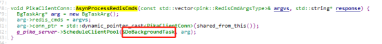

ThreadPool::Schedule里面，把参数封装成Task，然后push到线程池的任务队列，接着通知线程池处理，这里WorkerThread是生产者，线程池是消费者。

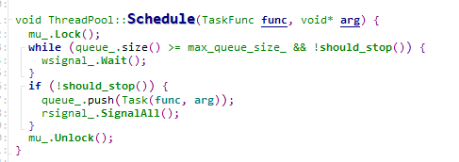

而线程池的工作线程，则是不断地在队列里面取出Task进行处理。

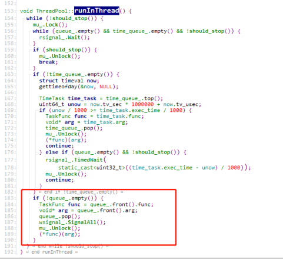

4.命令处理和响应流程

线程池里面实际处理命令的是DoBackgroundTask，我们先来看看命令是怎么被处理的。DoBackgroundTask里面调用的是PikaClientConn::BatchExecRedisCmd

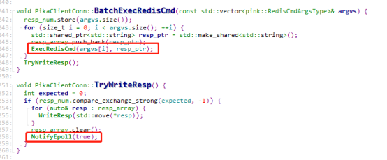

BatchExecRedisCmd里面是命令一个一个取出来ExecRedisCmd，然后PikaClientConn::DoCmd，响应消息先塞到resp_array，在TryWriteResp里面又把响应一个个取出来塞到response_里，并且把is_reply_置为true，然后做了一个NotifyEpoll的操作。

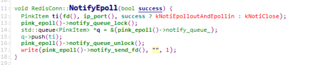

可以看到，这里把处理结果又封装成一个PinkItem，然后和前面介绍的监听线程把连接请求分发给WorkerThread一样，把PinkItem放到PinkEpoll的队列里面，然后通过在管道里面写了一个字节的字符触发epoll的读事件。所以我们回过头来看看WorkerThread的处理WorkerThread::ThreadMain

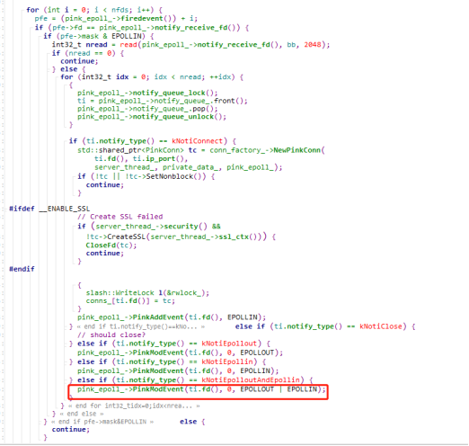

这里的流程和前面介绍的差不多，可以看到这里把这个连接的fd的读写事件重新加到epoll里面，前面我们留了一个疑问，在一次命令读取结束后，把连接fd的读写事件从epoll里面删除了，这是为啥呢？这里我们看到命令处理结束后又把读写事件加回来了。应该是因为pika用的是异步处理，一个连接的命令是异步地交给线程池处理，如果同个连接发了2个命令，因为是异步处理，没有办法保证2个命令满足FIFO，即先来的命令需要先回复，后来的命令后回复，redis是单线程模型，因此天然满足，pika是多线程异步处理，所以这里在读取了第一个命令后，把连接的读写事件删除了，等前一个命令处理完了才加回来，读取第二个命令来处理。

连接的fd加进epoll后，fd可写了，那么epoll会返回可写事件，用RedisConn::SendReply来发送响应给客户端，如果写完了会把fd的写事件给删掉，如果没写完，则等fd可写了会继续触发写事件来写回复。

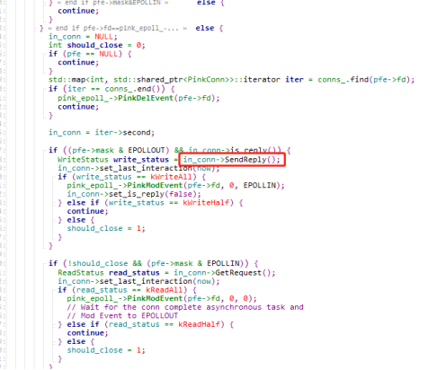

5.总结

通过上面的分析可以知道，监听线程是用来监听新的连接，连接来了会交由WorkerThread处理，已建立连接的请求会由WorkerThread封装成Task交给线程池ThreadPool处理，ThreadPool处理完了后，还是由WorkerThread来回复。WorkerThread就是做接收消息，回复消息的，而ThreadPool只是处理消息，不涉及接收和回复的IO操作。这3者的关系大概如下图所示：

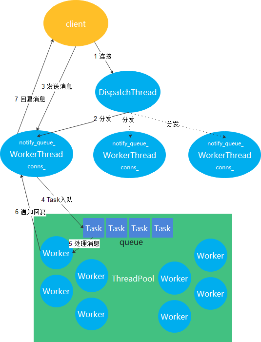